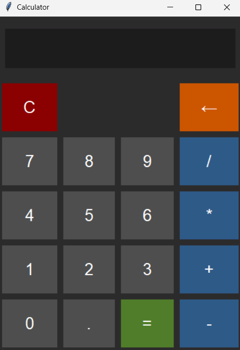
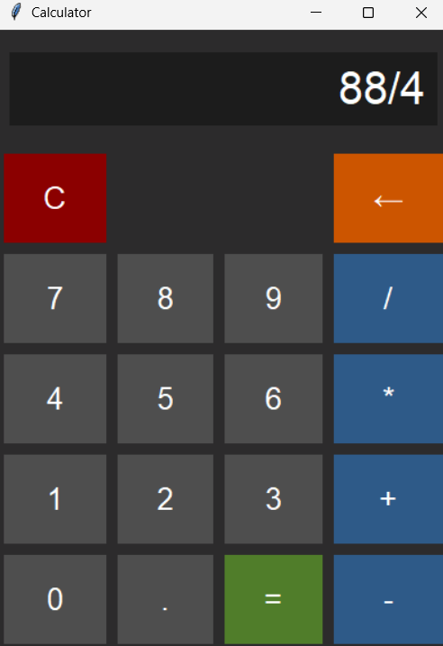
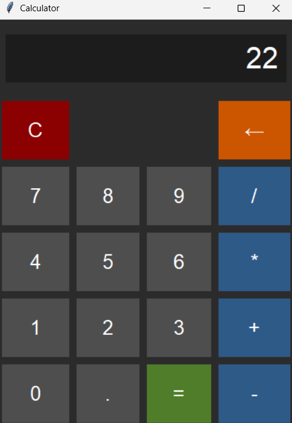

# Simple Calculator

This is a simple calculator that performs basic arithmetic operations (Addition, Subtraction, Multiplication, and Division).  
The numbers and operations can be controlled from the keyboard. (Enter for `=` and `Esc` for `C`).

# Technologies Used
- Python (tkinter)

# Output

